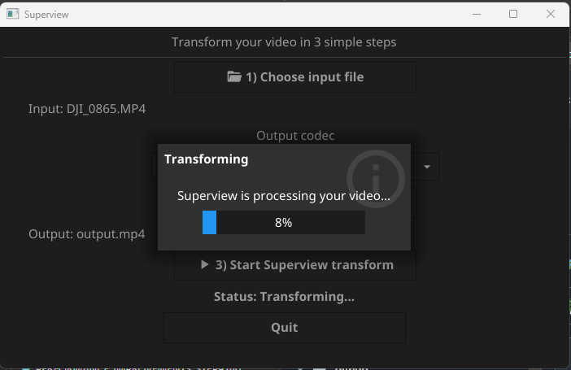

# Superview
<!-- ALL-CONTRIBUTORS-BADGE:START - Do not remove or modify this section -->
[](#contributors-)
<!-- ALL-CONTRIBUTORS-BADGE:END -->

Transform 4:3 aspect ratio videos to 16:9 using intelligent dynamic scaling, inspired by the GoPro SuperView method. This Go program smoothly stretches outer areas while preserving the center, creating a natural-looking widescreen conversion.

## Quick Links

- [Overview](#overview)
- [Requirements](#requirements)
- [Installation](#installation)
- [Usage (GUI/CLI)](#usage)
- [Configuration](#configuration)
- [Architecture](#architecture)
- [API Documentation](#api-documentation)
- [Development](#development)

## Overview

This program applies sophisticated distortion to convert 4:3 video to 16:9 widescreen:

- **Dynamic Scaling**: Outer areas stretched more aggressively, center maintains aspect ratio
- **Squeeze Mode**: Special handling for horizontally-stretched sources
- **Hardware Acceleration**: Supports available H.264/H.265 encoders and GPU acceleration
- **Flexible Configuration**: Customizable bitrate constraints and encoder selection
- **Simplified GUI Flow**: 3-step guided workflow with native file dialogs on Linux and Windows

The algorithm is based on [Banelle's original Python implementation](https://intofpv.com/t-using-free-command-line-sorcery-to-fake-superview), adapted for Go and FFmpeg.

Here is a quick animation showing the scaling, note how the text in the center stays the same:


## Requirements

Use the commands below.

### Linux (Ubuntu/Debian)

```bash
sudo apt update
sudo apt install -y ffmpeg golang build-essential pkg-config \
  libgl1-mesa-dev libxcursor-dev libxrandr-dev libxinerama-dev libxi-dev libxxf86vm-dev

ffmpeg -version
ffprobe -version
go version
gcc --version
```

### macOS (Homebrew)

```bash
brew update
brew install ffmpeg go pkg-config

ffmpeg -version
ffprobe -version
go version
clang --version
```

### Windows (PowerShell + winget)

```powershell
winget install -e --id Gyan.FFmpeg --accept-package-agreements --accept-source-agreements
winget install -e --id GoLang.Go --accept-package-agreements --accept-source-agreements
winget install -e --id BrechtSanders.WinLibs.POSIX.UCRT --accept-package-agreements --accept-source-agreements

ffmpeg -version
ffprobe -version
go version
gcc --version
```

If a command is not found after install, close and reopen your terminal so `PATH` is refreshed.

## Installation

### Option 1: Use prebuilt binaries (recommended for final users)

1. Download the archive matching your OS/CPU from [Releases](https://github.com/Canaill51/superview/releases).
2. Extract it.
3. Run one of the commands below.

Linux/macOS:
```bash
chmod +x superview-gui superview-cli
./superview-gui
# or CLI
./superview-cli -i input.mp4 -o output.mp4
```

Windows (PowerShell):
```powershell
.\superview-gui.exe
# or CLI
.\superview-cli.exe -i input.mp4 -o output.mp4
```

### Option 2: Build from source

Linux/macOS:
```bash
go build -o superview-gui superview-gui.go
go build -o superview-cli superview-cli.go
./superview-gui
```

Windows (PowerShell):
```powershell
go build -ldflags="-H=windowsgui" -o superview-gui.exe superview-gui.go
go build -o superview-cli.exe superview-cli.go
.\superview-gui.exe
```

## Usage

### Quick Run (GUI)

Linux/macOS:
```bash
./superview-gui
```

Windows (PowerShell):
```powershell
.\superview-gui.exe
```

GUI workflow:
1. Click **1) Choose input file**
2. (Optional) Select **Output codec**
3. Click **2) Choose output file**
4. Click **3) Start Superview transform**
5. Wait for encoding completion

Notes:
- GUI bitrate is fixed from configuration (`max_bitrate`), there is no manual bitrate field.
- Squeeze mode remains available in CLI (`-s`) but is not exposed in the simplified GUI.



### Quick Run (CLI)

Linux/macOS:
```bash
./superview-cli -i input.mp4 -o output.mp4
./superview-cli -i input.mp4 -o output.mp4 -e libx265 -b 5242880 -s
./superview-cli -h
```

Windows (PowerShell):
```powershell
.\superview-cli.exe -i input.mp4 -o output.mp4
.\superview-cli.exe -i input.mp4 -o output.mp4 -e libx265 -b 5242880 -s
.\superview-cli.exe -h
```

#### Options

```
  -i, --input=FILE      (required) Input video file path
  -o, --output=FILE     (optional) Output file (default: output.mp4)
  -e, --encoder=ENCODER Selected encoder (default: input codec)
  -b, --bitrate=BITRATE Output bitrate in bytes/second
  -s, --squeeze         Apply squeeze filter for stretched sources
```

If you get `Cannot find ffmpeg/ffprobe`, fix your `PATH` and retry.

### Configuration

Edit `superview.yaml` to customize:

```yaml
min_bitrate: 102400       # ~0.1 Mbps minimum
max_bitrate: 52428800     # ~50 Mbps maximum
temp_dir_prefix: "superview-*"
encoder_codecs: ["264", "265", "hevc"]
log_level: info
```

Override with environment variables:

```bash
export SUPERVIEW_MIN_BITRATE=262144
export SUPERVIEW_MAX_BITRATE=20971520
export SUPERVIEW_LOG_LEVEL=debug
./superview-cli -i input.mp4 -o output.mp4
```

## Architecture

### Project Structure

```
superview/
├── common/
│   ├── common.go              # Core encoding pipeline (CheckFfmpeg, CheckVideo, GeneratePGM, EncodeVideo)
│   ├── common_test.go         # Unit tests for core pipeline
│   ├── common_bench_test.go   # Benchmark tests (GeneratePGM performance)
│   ├── config.go              # Configuration management (YAML + env var overrides)
│   ├── config_test.go         # Config unit tests
│   ├── hardware.go            # Hardware capability profiling (CPU cores, GPU encoders, accels)
│   ├── hardware_test.go       # Hardware profiling tests
│   ├── health.go              # System health checks (ffmpeg, ffprobe, disk, memory, CPU)
│   ├── health_disk_unix.go    # Unix-specific disk space check
│   ├── health_disk_windows.go # Windows-specific disk space check
│   ├── health_test.go         # Health check tests
│   ├── metrics.go             # Encoding performance metrics (speed, compression, bitrate)
│   ├── metrics_test.go        # Metrics tests
│   ├── observability.go       # Event recording system and observability hooks
│   ├── observability_test.go  # Observability tests
│   ├── security.go            # Path validation, symlink protection, encoder sanitization
│   ├── security_test.go       # Security validation tests
│   └── command-*.go           # OS-specific process setup
├── tools/
│   ├── gen_icons.py           # Icon generation helper
│   └── install_linux_launcher.sh # Linux desktop launcher installer
├── superview-cli.go           # CLI entry point (go-flags)
├── superview-gui.go           # GUI entry point (Fyne)
├── superview.yaml             # Default configuration file
├── Makefile                   # Build, test, lint, and release automation
└── .goreleaser.yml            # GoReleaser cross-compilation config
```

### Encoding Pipeline

```
Startup → CheckHealth (ffmpeg, disk, memory, CPU)
              ↓
Input → CheckFfmpeg → CheckVideo → PerformEncoding → CleanUp → Output
                                         ↓
                               isValidInputPath + isValidOutputPath
                               GetBitrate + ValidateBitrate
                               GetEncoder + FindEncoder (whitelist)
                               InitEncodingSession (session-managed isolated temp dir, never working dir)
                               GeneratePGM (create remap filters)
                               EncodeVideo (ffmpeg with progress)
                               RecordEncodingMetrics (speed, ratio, bitrate)
```

## API Documentation

Public API in `common` package:

```go
// Configuration
GetConfig() *Config
SetConfig(cfg *Config)
LoadConfig(filepath string) (*Config, error)
CreateDefaultConfig(filepath string) error

// Logging
SetLogger(l *slog.Logger)
GetLogger() *slog.Logger

// Encoding Workflow
CheckFfmpeg() (map[string]string, error)
CheckVideo(file string) (*VideoSpecs, error)
PerformEncoding(inputFile, outputFile string, ui UIHandler, 
                ffmpeg map[string]string) error
```

Implement the `UIHandler` interface for custom UIs:

```go
type UIHandler interface {
    ShowError(error)
    ShowInfo(msg string)
    ShowProgress(percent float64)
    GetBitrate() (int, error)
    GetEncoder() string
    GetSqueeze() bool
}
```

### Example: Custom Handler

```go
type MyHandler struct{}

func (h *MyHandler) ShowError(err error) { log.Printf("ERROR: %v\n", err) }
func (h *MyHandler) ShowInfo(msg string) { fmt.Println("INFO:", msg) }
func (h *MyHandler) ShowProgress(percent float64) { fmt.Printf("%.1f%%\r", percent) }
func (h *MyHandler) GetBitrate() (int, error) { return 5242880, nil }
func (h *MyHandler) GetEncoder() string { return "libx265" }
func (h *MyHandler) GetSqueeze() bool { return false }

// Use it
ffmpeg, _ := common.CheckFfmpeg()
common.PerformEncoding("input.mp4", "output.mp4", &MyHandler{}, ffmpeg)
```

## Development

### Build & Test

```bash
# Run tests with coverage
go test ./common -cover

# Run package tests (repo root has 2 mains)
go test ./common

# Build binaries
go build superview-cli.go
go build superview-gui.go

# Cross-platform build
./build.sh v1.0.0  # Requires fyne-cross
```

```powershell
# Windows GUI build without terminal window
go build -ldflags="-H=windowsgui" -o superview-gui.exe superview-gui.go
```

```bash
# OS-specific make targets
make build-cli-linux
make build-cli-macos
make build-cli-windows
make build-gui-linux
make build-gui-macos
make build-gui-windows

# Quality checks
make test          # Run all tests
make coverage      # Tests with coverage report
make lint          # golangci-lint
make vet           # go vet
make vuln          # govulncheck security scan
make check         # All quality checks at once

# Benchmark tests (GeneratePGM performance)
go test -bench=. ./common -benchmem -run=^$

# Release automation
make release-prepare VERSION=1.0.0   # Tag and validate release
make release-dry-run                 # Dry-run goreleaser
```

### Recent Improvements

- **Étape 1**: Go 1.22+, dependency updates
- **Étape 2**: Secure temp file handling
- **Étape 3**: Custom error types, validation
- **Étape 4**: UIHandler interface, reduced duplication
- **Étape 5**: 32 comprehensive unit tests
- **Étape 6**: Structured logging with slog
- **Étape 7**: External configuration (YAML + env vars)
- **Étape 8**: Full documentation (Godoc + this README)
- **Étape 9**: Performance optimization — `GeneratePGM` rewritten with `strconv.AppendInt` and pre-allocated buffers for **-47% processing time, -100% hot-path allocations** (see `common/common_bench_test.go`); benchmark suite added
- **Étape 10**: Advanced security — input/output path validation, directory traversal prevention, symlink attack protection, encoder whitelist sanitization (`common/security.go`)
- **Étape 11**: CI/CD pipeline — GitHub Actions with multi-OS × Go-version matrix (Ubuntu, macOS, Windows × Go 1.22/1.23), 30% coverage gate, native binary builds per platform
- **Étape 12**: Distribution — GoReleaser cross-compilation for CLI, native GUI builds per OS, automated multi-platform releases with checksums; `Makefile` build/lint/release targets
- **Étape 13**: Observability & monitoring — `EncodingMetrics` (speed, compression ratio, bitrate), `ObservabilityHandler` event system (start/progress/complete/error), system health checks (`CheckHealth`), structured logging throughout the pipeline

## Contributors ✨

Thanks goes to these wonderful people ([emoji key](https://allcontributors.org/docs/en/emoji-key)):

<!-- ALL-CONTRIBUTORS-LIST:START - Do not remove or modify this section -->
<!-- prettier-ignore-start -->
<!-- markdownlint-disable -->
<table>
  <tr>
    <td align="center"><a href="https://github.com/naorunaoru"><br /><sub><b>Roman Kuraev</b></sub></a><br /><a href="#ideas-naorunaoru" title="Ideas, Planning, & Feedback">🤔</a> <a href="https://github.com/Niek/superview/commits?author=naorunaoru" title="Code">💻</a></td>
    <td align="center"><a href="https://github.com/dangr0"><br /><sub><b>dangr0</b></sub></a><br /><a href="https://github.com/Niek/superview/issues?q=author%3Adangr0" title="Bug reports">🐛</a></td>
    <td align="center"><a href="https://github.com/dga711"><br /><sub><b>DG</b></sub></a><br /><a href="#ideas-dga711" title="Ideas, Planning, & Feedback">🤔</a> <a href="https://github.com/Niek/superview/commits?author=dga711" title="Tests">⚠️</a></td>
    <td align="center"><a href="https://github.com/tommaier123"><br /><sub><b>Nova_Max</b></sub></a><br /><a href="https://github.com/Niek/superview/commits?author=tommaier123" title="Documentation">📖</a></td>
  </tr>
</table>

<!-- markdownlint-enable -->
<!-- prettier-ignore-end -->
<!-- ALL-CONTRIBUTORS-LIST:END -->

This project follows the [all-contributors](https://github.com/all-contributors/all-contributors) specification. Contributions of any kind welcome!