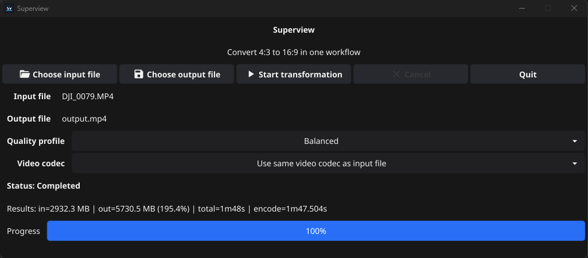

# Superview
<!-- ALL-CONTRIBUTORS-BADGE:START - Do not remove or modify this section -->
[](#contributors-)
<!-- ALL-CONTRIBUTORS-BADGE:END -->

Transform 4:3 aspect ratio videos to 16:9 using intelligent dynamic scaling, inspired by the GoPro SuperView method. This Go program smoothly stretches outer areas while preserving the center, creating a natural-looking widescreen conversion.

> It is an *approximation* of GoPro's SuperView, not a reproduction of it: the distortion curve comes from [Banelle's original implementation](https://intofpv.com/t-using-free-command-line-sorcery-to-fake-superview) and aims for a comparable result, not identical output.

> Officially supported platforms: **Windows** and **Linux** (Ubuntu 24.04 LTS+).
> Superview is distributed and maintained as a **GUI-only** application.
> The current codebase targets **Go 1.26+**.

## Quick Links

- [Overview](#overview)
- [Requirements](#requirements)
- [Hardware acceleration](#hardware-acceleration)
- [Installation](#installation)
- [Usage (GUI)](#usage)
- [Configuration](#configuration)
- [Architecture](#architecture)
- [Development](#development)

For contributors: [RELEASING.md](RELEASING.md) covers how a release is made,
[docs/CONTRATS.md](docs/CONTRATS.md) what the code guarantees, and
[docs/hardware-support.md](docs/hardware-support.md) which GPUs generally work.

## Overview

This program applies sophisticated distortion to convert 4:3 video to 16:9 widescreen:

- **Dynamic Scaling**: Outer areas stretched more aggressively, center maintains aspect ratio
- **Hardware Acceleration**: Supports available H.264/H.265 encoders and GPU acceleration
- **Flexible Configuration**: Customizable bitrate constraints and encoder selection
- **MP4 in, MP4 out**: the file pickers offer MP4 only, and the output extension is enforced
- **Faithful to the source**: 10-bit footage stays 10-bit when encoding to H.265 (HERO 10 and
  later record 10-bit), every audio track is carried over, and the recording date is preserved
- **Simplified GUI Flow**: 3-step guided workflow with native file dialogs
- **Squeeze Mode**: tick *Source already stretched to 16:9 (un-squeeze)* when the camera already
  stored a 4:3 capture stretched to 16:9 -- GoPro's SuperView recording modes, the Caddx Tarsier
  and similar. Superview then un-stretches the centre instead of widening the frame. The curve is
  an approximation of the inverse stretch, not a reproduction of any camera's own algorithm
- **System Diagnostic**: the *Diagnostic* button reports ffmpeg/ffprobe availability, free disk
  space, memory and CPU -- attach its output to any bug report

Superview now shows a hardware diagnostic in the GUI:

- the planned path before launch, for example `h264_nvenc + D3D11VA`
- the actual path used after the run, including CPU fallback when FFmpeg or the driver rejects a hardware path

The algorithm is based on [Banelle's original Python implementation](https://intofpv.com/t-using-free-command-line-sorcery-to-fake-superview), adapted for Go and FFmpeg.

Here is a quick animation showing the scaling, note how the text in the center stays the same:


## Requirements

### Official (Windows)

Use the commands below.

```powershell
winget install -e --id Gyan.FFmpeg --accept-package-agreements --accept-source-agreements

ffmpeg -version
ffprobe -version

```

If a command is not found after install, close and reopen your terminal so `PATH` is refreshed.

### Linux (Ubuntu 24.04 LTS / 26.04 LTS)

Install FFmpeg and the system libraries required to build/run the Fyne GUI:

```bash
sudo apt update
sudo apt install -y ffmpeg libgl1-mesa-dev xorg-dev libwayland-dev libxkbcommon-dev
```

> `libwayland-dev` and `libxkbcommon-dev` are needed since Fyne 2.8, which moved
> to GLFW 3.4 and its Wayland backend. They are build-time requirements only.

Optional, for native file dialogs (falls back to the Fyne dialog otherwise):

```bash
sudo apt install -y zenity
```

Check FFmpeg NVENC support if you have an Nvidia GPU:

```bash
ffmpeg -hide_banner -encoders | grep nvenc
```

## Hardware acceleration

Superview asks your installed FFmpeg build which hardware encoders it has, rather
than matching your GPU against a list. It targets `h264_nvenc`/`hevc_nvenc` (Nvidia),
`h264_amf`/`hevc_amf` (AMD) and `h264_qsv`/`hevc_qsv` (Intel), and falls back to
`libx264`/`libx265` on the CPU whenever a hardware path is unavailable or refused.

The GUI shows the planned path before launch, for example `h264_nvenc + D3D11VA`,
and the path actually used once the run finishes.

For the GPU families that generally work, and what to check when a card that should
be supported does not appear, see **[docs/hardware-support.md](docs/hardware-support.md)**.

## Installation

### Option 1: Use prebuilt binaries (recommended for final users)

Every release publishes an archive per platform plus a `checksums.txt`, on the
[Releases](https://github.com/Canaill51/superview/releases) page.

**Windows** — download `superview-gui-<version>-windows-x86_64.zip`, extract it, and
run `superview-gui.exe`:

```powershell
.\superview-gui.exe
```

**Linux** — download `superview-gui-<version>-linux-x86_64.tar.xz`. The archive carries
the binary, a `.desktop` entry, an icon and a `Makefile`, so you can either run it in
place or install it:

```bash
tar -xJf superview-gui-<version>-linux-x86_64.tar.xz

./superview/usr/local/bin/superview      # run it where it is
sudo make -C superview install           # or install it into /usr/local
```

**Verify what you downloaded.** Put `checksums.txt` next to the archives and run:

```bash
sha256sum -c checksums.txt          # Linux
```

```powershell
Get-FileHash superview-gui-*-windows-x86_64.zip -Algorithm SHA256   # Windows
```

The binary reports its own identity -- release number, the commit it was built from,
and whether the tree was modified -- in the window title, the first line of the
Diagnostic report and the log at startup. Quote it in any bug report.

### Option 2: Build from source

Official local build flow (Windows GUI):

```powershell
go build -ldflags="-H=windowsgui" -o superview-gui.exe .
```

Then launch:

```powershell
.\superview-gui.exe
```

Linux:
```bash
go build -o superview-gui .
```

Then launch:

```bash
./superview-gui
```

## Usage

### Quick Run

Windows (PowerShell):
```powershell
.\superview-gui.exe
```

GUI workflow:
1. Click **1) Choose input file**
2. Select **Quality** (**Fast** or **Balanced**)
3. (Optional) Select **Video codec**
4. Click **2) Choose output file**
5. Click **3) Start Superview transform**
6. Wait for encoding completion

Notes:
- Both quality profiles request the same bitrate: 4/3 of the source's, which is
  exactly how much the pixel count grows when a 4:3 frame is widened to 16:9, so
  the output holds the bits per pixel of the source. They differ by encoder
  preset alone.
- `Fast`: quicker encode, same bitrate.
- `Balanced`: slower preset, slightly better detail at the same size.
- The app asks for confirmation before overwriting an existing output file.
- The GUI shows the planned hardware path before launch and the actual path used after encoding completes.



If you get `Cannot find ffmpeg/ffprobe`, fix your `PATH` and retry.

### Configuration

Superview looks for `superview.yaml` in this order, and uses the first file it finds:

1. `$SUPERVIEW_CONFIG` (explicit path, wins over everything)
2. next to the executable
3. `~/.config/superview/superview.yaml` (Linux) or `%AppData%\superview\superview.yaml` (Windows)
4. the current working directory

If none exists, built-in defaults apply. This is the `superview.yaml` shipped with
the project:

```yaml
min_bitrate: 102400       # ~0.1 Mbps minimum
max_bitrate: 209715200    # ~200 Mbps maximum
temp_dir_prefix: "superview-*"
encoder_codecs: ["264", "265", "hevc"]
log_level: info
performance_mode: safe_performance    # safe = re-encode audio to AAC | safe_performance = copy audio
video_preset: ""         # optional: ultrafast..veryslow (empty = ffmpeg default)
filter_threads: 0         # 0 = auto/default
encoder_threads: 0        # 0 = auto/default
```

> One value differs between this file and the built-in defaults: the shipped file
> sets `performance_mode: safe_performance` (copy the audio stream untouched),
> whereas the built-in default, used when no config file is found at all, is
> `safe` (re-encode audio to AAC). Deleting your `superview.yaml` therefore
> changes how audio is handled.

Override with environment variables:

```bash
export SUPERVIEW_MIN_BITRATE=262144
export SUPERVIEW_MAX_BITRATE=209715200
export SUPERVIEW_LOG_LEVEL=debug
export SUPERVIEW_PERFORMANCE_MODE=safe_performance
export SUPERVIEW_VIDEO_PRESET=fast
export SUPERVIEW_FILTER_THREADS=4
export SUPERVIEW_ENCODER_THREADS=8
./superview-gui
```

## Architecture

### Project Structure

```
superview/
├── common/                     # Encoding logic, shared by any front end
│   ├── common.go               # Pipeline, session lifecycle, ffprobe/ffmpeg calls
│   ├── config.go               # Configuration loading and defaults
│   ├── hardware.go             # Hardware capability profiling
│   ├── health.go               # System health checks (the Diagnostic button)
│   ├── metrics.go              # Encoding metrics
│   ├── observability.go        # Event recording and logging
│   ├── security.go             # Path and input validation
│   ├── command-*.go            # OS-specific process setup
│   ├── health_disk_*.go        # Free-disk-space probe per platform
│   ├── *_test.go               # Unit, golden and integration tests
│   └── testdata/ffprobe/       # Recorded ffprobe output the parser is tested against
├── docs/                       # Technical contracts, audit journal, hardware support
├── gui_main.go                 # GUI entry point (Fyne)
├── gui_native_dialog_*.go      # Native file dialogs (zenity/kdialog, PowerShell)
├── superview.yaml              # Default configuration
├── FyneApp.toml                # Fyne packaging metadata
├── Makefile                    # Local build and quality targets
└── RELEASING.md                # How a release is made
```

### Encoding Pipeline

```
Input → CheckFfmpeg → CheckVideo → InitEncodingSession → GeneratePGM → EncodeVideo → CleanUp → Output
                                              ↓
                               ValidateBitrate + FindEncoder
                               VideoSpecs.Validate()
                               EncodingMetrics / Observability hooks
```

## Development

Use the commands below.

```powershell
winget install -e --id Gyan.FFmpeg --accept-package-agreements --accept-source-agreements
winget install -e --id GoLang.Go --accept-package-agreements --accept-source-agreements
winget install -e --id BrechtSanders.WinLibs.POSIX.UCRT --accept-package-agreements --accept-source-agreements
```

### Build & Test

```bash
make test        # go test ./... -- the whole module, as CI does
make coverage    # coverage over ./..., which the 50% CI gate measures
make check       # fmt, vet, lint, coverage and govulncheck
make build       # GUI binary for the current platform
```

`make build-gui-windows` is Windows-native: Fyne draws through cgo, so setting
`GOOS=windows` from Linux gives no C toolchain and the link step fails. The release
workflow builds each platform on its own runner for the same reason.

Set `SUPERVIEW_REQUIRE_FFMPEG=1` to turn the ffmpeg-dependent skips into failures --
this is what CI does, so that a green suite cannot mean "encoded nothing".

Releases are made from the Actions tab and are documented in
[RELEASING.md](RELEASING.md). There is no local release script.

## Contributors ✨

Thanks goes to these wonderful people ([emoji key](https://allcontributors.org/docs/en/emoji-key)):

<!-- ALL-CONTRIBUTORS-LIST:START - Do not remove or modify this section -->
<!-- prettier-ignore-start -->
<!-- markdownlint-disable -->
<table>
  <tr>
    <td align="center"><a href="https://github.com/naorunaoru"><br /><sub><b>Roman Kuraev</b></sub></a><br /><a href="#ideas-naorunaoru" title="Ideas, Planning, & Feedback">🤔</a> <a href="https://github.com/Canaill51/superview/commits?author=naorunaoru" title="Code">💻</a></td>
    <td align="center"><a href="https://github.com/dangr0"><br /><sub><b>dangr0</b></sub></a><br /><a href="https://github.com/Canaill51/superview/issues?q=author%3Adangr0" title="Bug reports">🐛</a></td>
    <td align="center"><a href="https://github.com/dga711"><br /><sub><b>DG</b></sub></a><br /><a href="#ideas-dga711" title="Ideas, Planning, & Feedback">🤔</a> <a href="https://github.com/Canaill51/superview/commits?author=dga711" title="Tests">⚠️</a></td>
    <td align="center"><a href="https://github.com/tommaier123"><br /><sub><b>Nova_Max</b></sub></a><br /><a href="https://github.com/Canaill51/superview/commits?author=tommaier123" title="Documentation">📖</a></td>
  </tr>
</table>

<!-- markdownlint-enable -->
<!-- prettier-ignore-end -->
<!-- ALL-CONTRIBUTORS-LIST:END -->

This project follows the [all-contributors](https://github.com/all-contributors/all-contributors) specification. Contributions of any kind welcome!